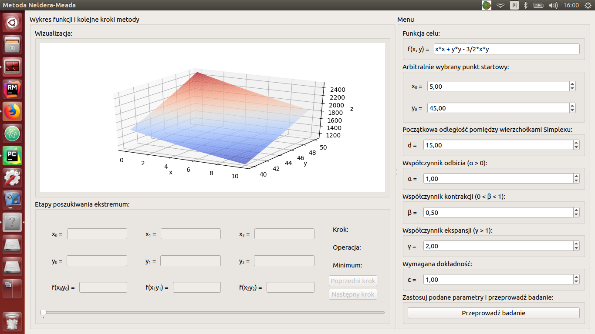
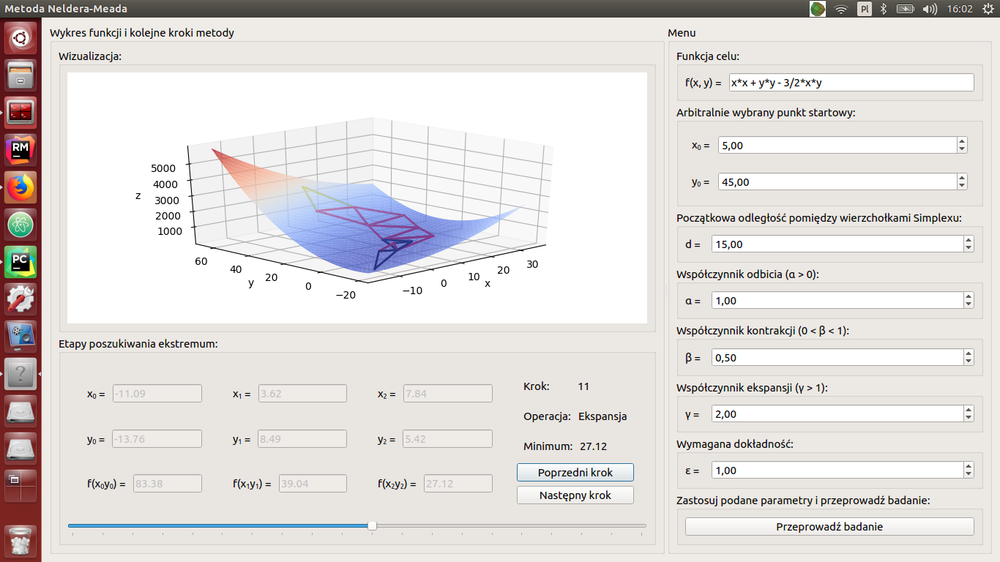
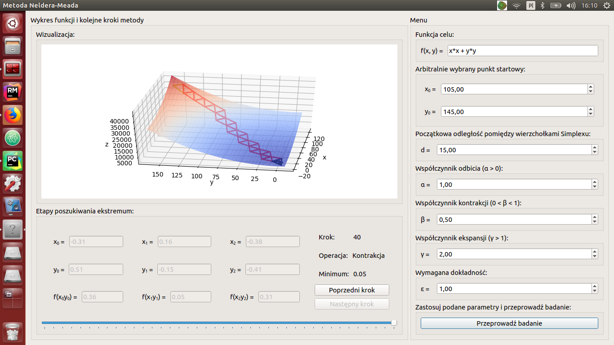
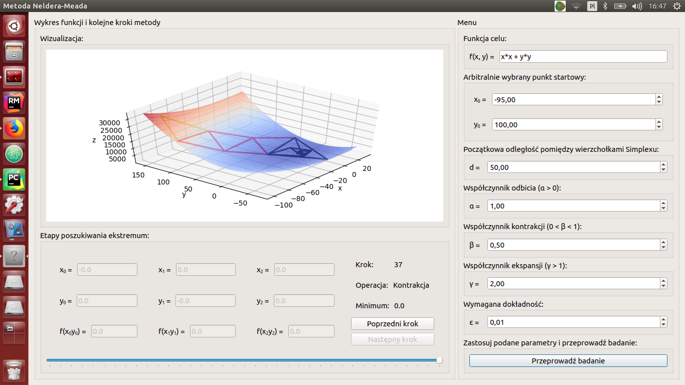
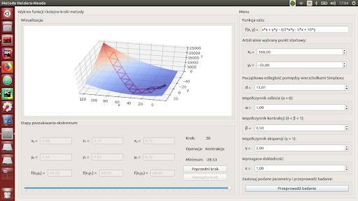

# Simplex

Implementation and visualization of the Nelder-Mead algorithm - non-gradient methods of minimizing functions of many variables without constraints.

## Table of contents
* [Simplex](#simplex)
	* [Setup](#setup)
	* [Usage](#usage)
* [Project](#project)
	* [Basic terms](#basic-terms)
	* [Introduction](#introduction)
	* [Description of the method](#description-of-the-method)
	* [The algorithm](#the-algorithm)
	* [Algorithm implementation](#algorithm-implementation)
	* [Examples of calculations using the program](#examples-of-calculations-using-the-program)
	* [Summary](#summary)
	* [References](#references)

## Setup
Clone this repo to your desktop and install all the dependencies.

## Usage
Just run command `python main.py` to run an application. Then choose in the right column type of test you want to conduct and it's parameters. If you want start a symulation click button "Przeprowadź badanie".

# Project

## Basic terms

$E^n$ - Euclidean space (Cartesian space), i.e. the space of real coordinates with the introduced structure of Euclidean geometry

$f (x)$ - objective function

class of function $C^n$ - a function is of class n if there is an $n$-th derivative. Example: a function is of class $C^2$ if it has a second derivative.

$n$-dimensional simplex - $n$-dimensional polyhedron, which is a convex envelope of $n + 1$ vertices. Is the set of all points defined by the vectors:

$$ \overline{x} = \sum_{i = 1}^{n + 1}x_i \xi_i $$

where $\sum_{i = 1}^{n + 1} x_i = 1$ and $x_i \geq 0$,
where $\xi_i$ denote vectors and $x_i$ denote the coordinates of the simplex points.

By $P_h$ we shall denote a selected simplex vertex among its $n + 1$vertices $P_1$, $P_2$, ..., $P_{n + 1}$. At point Ph, the value of the tested function reaches its maximum.

By $P_l$ we denote a selected simplex vertex among its $n + 1$ vertices $P_1$, $P_2$, ..., $P_{n + 1}$. In point $P_l$, the value of the tested function reaches the minimum.

By $\overline{P}$ we will denote the symmetry center of the simplex excluding the vertex point $P_h$.

$$\overline{P} = \frac{\sum_{i=1}^{n+1} P_i}{n} ,i \neq h$$

## Introduction

The Nelder-Mead method is a gradientless minimization of multivariable functions without constraints. Other such methods include Rosenbrock method and Powell method.

It is a numerical method, i.e. performing operations on numbers for a specific problem. Such methods are used when the analytical methods are too complex and only serve as a theoretical tool (e.g. Lagrange theory and Kuhn and Tucker theory).

As mentioned at the beginning, it is also a gradientless method, which means that the method requires the calculation of the value of the function itself. Such methods are also called "direct search" methods. In contrast, gradient methods require the computation of both the value of the function and its first derivatives (the gradient of the function).

In this method, only the convexity of the objective function f (x) is assumed. It is similar in the methods of Hook and Jeeves and Rosenbrock. In other gradientless methods, it is additionally required that the objective function is limited from below by the function of class $C^2$ and that it can be approximated sufficiently well by the quadratic form.

## Description of the method

The method consists in creating an $n$-dimensional simplex with $n + 1$ vertices in the $E^n$ space in such a way that it is possible to inscribe it into the surface representing the tested objective function $f(x)$.

At the beginning of the procedure, the coordinates of the simplex vertex points P1, P2, ..., Pn + 1 are calculated.

When calculating the coordinates of the points $P_1$, $P_2$, ..., $P_{n + 1}$, an arbitrarily assumed distance between them is assumed, called "step".

In subsequent iterations, simplex transformations are performed (the "reflection", "expansion" and "contraction" operations described in the following paragraphs). The iterations are performed as long as the distance between the vertices $P_1$, $P_2$, ..., $P_{n + 1}$ near the searched minimum is not greater than the assumed accuracy $\varepsilon$.

Before starting the calculations, it is necessary to determine the input information:
* $x_0$ - arbitrarily selected starting point,
* $d$- initial distance between the vertices of the output simplex,
* $\alpha$ - reflection coefficient, $\alpha> 0$,
* $\beta$ - contraction coefficient, $0 < \beta < 1$,
* $\gamma$ - expansion coefficient, $\gamma > 1$,
* $\varepsilon$ - required accuracy,
* $n$ - number of independent variables.

The previously mentioned operations are:
* the operation of **"reflecting"** the point $P_h$ in relation to the point $\overline{P}$ is defined by the equation:
$$P^{*} = (1+\alpha) \overline{P} - \alpha P_h$$

* operation of **"expansion"** of the point $P ^{**}$ in relation to $\overline{P}$ is represented by the equation:
$$P ^{**} = (1-\gamma) P^{*} - \gamma \overline{P}$$

* operation of **"contracting"** the point $P_h$ in relation to $\overline{P}$ is represented by the equation:
$$P^{***} = \beta P_h + (1-\beta) \overline{P}$$

The numerical values ​​of the coefficients $\alpha$, $\beta$, $\gamma$ used should be selected experimentally. Nelder and Mead in the examples considered by them gave the optimal values: $\alpha = 1$, $\beta = 0.5$, $\gamma = 2$ .

The iteration termination criterion is that the distance between the vertices of the simplex is less than a predetermined $\varepsilon$.

## The algorithm

The algorithm of the Nelder-Mead method will be presented below in the form of subsequent steps:

1. Calculation of coordinates of simplex vertex points $P_1$, $P_2$, ..., $P_{n + 1}$.
2. Calculating the value of the objective function in simplex vertices.
$F_i = f (P_i)$ for $i = 1, 2, ..., n + 1$
3. Determination of $h$ and $l$ such that $f (P_h)$ is the greatest and $f (P_l)$ is the smallest of all $F_i = f (P_i)$.
4. Calculating the center of symmetry of a simplex $\overline{P}$:
$$\overline{P} = \frac{\sum_{i=1}^{n+1} P_i}{n} ,i \neq h$$
5. Reflecting $P^{*}$ of the $P_h$ point with relative to the point $\overline{P}$.
6. Calculation of $F_s$ and $F_o$:
$$F_s = f (\overline{P})$$
$$F_o = f (P^{*})$$
7. If $F_o <f (P_l)$ (i.e. $F_o$ is smaller than the minimum), then:
7.1 Calculation of $F_e$ by using the "expansion" operation:
$$P ^{**} = (1-\gamma) P^{*} - \gamma \overline{P}$$
$$F_e = f (P ^{**})$$
7.2 If $F_e <f (P_h)$ (i.e. $F_e$ is smaller than the maximum), then:
7.2.1 Substitution for $Ph$ point $P ^{**}$
7.3 If $F_e \geq f (P_h)$ then:
7.3.1 Substitution for $P_h$ point $P ^{*}$
7.4 If the minimum criterion is not met, repeat the procedure from step 2.
8. If $F_o > f (P_l)$ then:
8.1 If $Fo \geq f (P_i)$ for $i = 1, 2, ..., n + 1$, $i \neq h$ and $F_o \geq f (P_h)$ (i.e. $F_o$ is greater than or equal to the maximum)
8.1.1 Continue the algorithm from step 8.3
8.2 Otherwise, if $F_o <f (P_h)$ (i.e. $F_o$ is less than the maximum)
8.2.1 Substituting for $P_h$ value of $P ^{*}$ ​​and continuing the algorithm from step 8.3.
8.3 Performing the operation of "contracting" $P ^{***}$ of the point $P_h$ in relation to $\overline{P}$ and calculation of $F_k$:
$$P^{***} = \beta P_h + (1-\beta) \overline{P}$$
$$F_k = f (P ^{***})$$
8.4 If $F_k \geq f (P_h)$ (i.e. $F_k$ is greater than or equal to the maximum) then:
8.4.1 Performing simplex reduction:
$P_i = \frac{P_i + P_l}{2}$, $i = 1, 2, ..., n + 1$
8.4.2 Continuing the algorithm from step 8.6.
8.5 If $F_k < f (P_h)$ (i.e. $F_k$ is smaller than the maximum) then:
8.5.1 Substitution for $P_h$ point $P ^{***}$
8.5.2 Continuing the algorithm from step 8.7.
8.6 If $F_o < f (P_i)$ for $i = 1, 2, ..., n + 1$, $i \neq h$
8.6.1 Substitution for $P_h$ point $P ^{*}$
8.7 If the minimum criterion is not met, repeat the procedure from step 2.

## Algorithm implementation

The programming language of choice was `Python 3.7.3`. The `PyQt5` library was used to create the program, and the `matplotlib` library was used to generate the graphs.

An executable file with the .exe extension has been generated and is available for download at:
https://drive.google.com/open?id=1pCTB4BJodl62rUuBTGlyYDdsMxYnTCC8

After opening the program (executable .exe file), the user is presented with a window divided into two parts, as shown in Figure below.

On the right side of the window there is a form in which it is possible to provide input data for the algorithm. Particular attention should be paid to the first field, which is the objective function formula. It allows you to use the x and y variables and math operations using Python notation. The remaining values ​​are numerical data set in the description of the method.

In the left part of the window, there is a visualization in the form of a graph of a function with two arguments (three-dimensional graph). After performing the calculations, the graph is updated with the calculated simplexes. It is possible to check the calculations "step by step" through the form under the graph of the objective function. It contains the coordinates of the simplex nodes along with the values ​​of the objective function, the operation performed (reflection, expansion or contraction) and the current found minimum. An example of the calculations performed together with going back to one of the previous steps is presented in Figure below.

## Examples of calculations using the program

This chapter presents examples of searching for the minimum for selected objective functions and other parameters related to the Nelder-Mead method.

### Example 1, objective function: $f(x, y) = x^2 + y^2$

In this case, the optimal values of the method parameters were used, i.e. $\alpha = 1$, $\beta = 0.5$, $\gamma = 2$. The point $(x_0, y_0) = (105, 45)$ was chosen as the starting point and the initial distance between the nodes of the simplex equal to $d = 15$. The required accuracy, i.e. the maximum distance between the nodes of the last computed simplex, is  $\varepsilon = 1$. The results of the study are presented in Figure below.

The method took 40 steps to find the minimum of 0.05. The first 28 steps are reflection operations (shown as red simplexes). The next 12 steps are expansion and contraction operations that bring the simplex vertices closer together to achieve the required accuracy.

### Example 2, objective function: $f(x, y) = x^2 + y^2$

In this case, the same objective function and the same parameter values as in Example 1 were used, but a different starting point was chosen $(x_0, y_0) = (-95, 100)$, the initial distance between the simplex nodes equals $d = 50$ and the required accuracy  $\varepsilon = 0.01$. This example aims to show what steps the algorithm will take for the same objective function but changes the remaining key start conditions. The results of the study are presented in Figure below.

In this study, only the first 4 steps are reflection operations. The remaining steps are contraction and expansion operations for which the simplex vertices come closer to each other. For the assumed required accuracy, the found minimum equal to 0 was achieved (which is the global minimum for this objective function).

### Example 3, objective function: $f(x, y) = x^2 + y^2 - \frac{3}{2}xy - 5x + 10y$

In this case, non-optimal values of the method parameters $\alpha = 2$, $\beta= 0.7$, $\gamma = 4$ were used. The point $(x_0, y_0) = (100, -50)$ was chosen as the starting point and the initial distance between the simplex vertices equal to $d = 15.01$. The required precision, i.e. the maximum distance between the vertices of the last computed simplex, is $\varepsilon = 1$. The results of the conducted study are presented in Figure below.

Based on the visualization, it is possible to observe how the course of the method was influenced by the change of parameters $\alpha$, $\beta$, $\gamma$. Reflection operations as a result of increasing the parameter value reflect the simplex vertex with the largest value of the objective function over a greater distance than it was when $\alpha = 1$. The change of the coefficients $\beta$ and $\gamma$ resulted in a greater concentration of terminal simplexes, for which the vertices of successive simplexes come closer together in order to achieve the required accuracy. In this case, the algorithm took 41 steps and found a minimum of -28.52. In the next example, for the same objective function and initial parameters of the method, the results for the optimal values of the parameters $\alpha$, $\beta$, $\gamma$ will be compared.

### Example 4, objective function: $f(x, y) = x^2 + y^2 - \frac{3}{2}xy - 5x + 10y$

In this case, the optimal values of the method parameters $\alpha = 1$, $\beta = 0.5$, $\gamma = 2$ were used. The point $(x_0, y_0) = (100, -50)$ was chosen as the starting point and the initial distance between the simplex vertices equal to $d = 15.01$. The required precision, i.e. the maximum distance between the vertices of the last computed simplex, is $\varepsilon = 1$. The results of the study are presented in Figure below.

In this case, the flow of the algorithm is significantly different than for Example 3. Here, the first 16 operations are reflection operations. The remaining operations are both rebound and contraction operations. The algorithm took 30 steps to find the minimum of -28.53. It can be concluded that the appropriate selection of parameters $\alpha$, $\beta$, $\gamma$ greatly influences the number of steps needed to find the minimum.

## Summary

The most important goal of the project was to learn about the Nelder-Mead method, which is a non-gradient method of minimizing the functions of many variables without constraints. For this purpose, the assumptions of this method, the operations used in it and the algorithm in the form of a list of steps have been presented.

Thanks to the good description, it was possible to implement this method and create a simulation program that would allow to conduct tests with the possibility of performing subsequent steps of the algorithm. An important element of the simulation program is the visualization in the form of a graph of the objective function of two variables with marked simplices.

The conducted and described examples of research have shown that when searching for a minimum using this method, both the adopted initial conditions, i.e. the selected starting point and the distance between the vertices of the initial simplex, are important. The parameters,, have the greatest influence on the course of the method and the number of steps.

Based on the conducted research, it can also be noticed that for optimal values $\alpha = 1$​​, $\beta = 0.5$, $\gamma = 2$, the method in the initial phase only performs reflection operations (then the subsequent simplexes are close to the minimum, but the distances between their vertices are kept). In the next phase, contraction and expansion operations are performed, bringing the simplex vertices closer together to achieve the required accuracy $\alpha$, $\beta$, $\gamma$.

It is a numerical method with some assumed accuracy. For this reason, the proper global minimum of functions that could be found by other methods will not always be achieved. Nevertheless, the found minimum is very close to the proper function minimum, which is sufficient in many cases. The most important advantage of this method is the small number of calculations, so finding the minimum using this method is fast and inexpensive in terms of memory and time used.

## References

Theoretical introduction, method description and algorithm:
Władysław Findeisen, Jacek Szymanowski, Andrzej Wierzbicki, Metody Obliczeniowe Optymalizacji, Warszawa 1972
